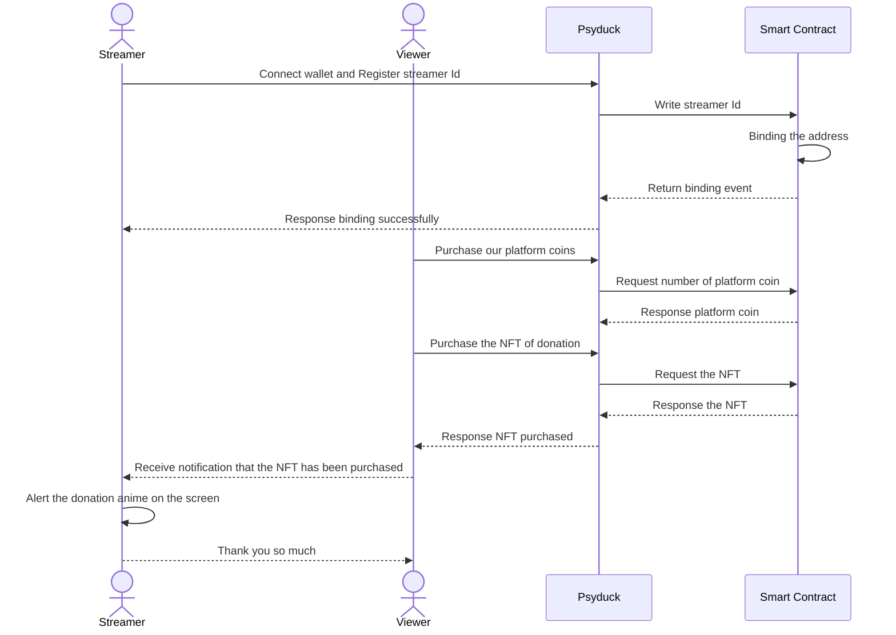

<h1>Girudo</h1>

</img>

### Demo Page

- Video: [Girudo demo](https://youtu.be/aFThCDy1UNg?si=9SaA8jX0pGBX45nK)
- Girudo Contract:
  - Ethereum Optimism sepolia:
  - Sui:
  - Solana:
  - Zircuit:

### Abstract

Our platform is designed specifically for DAO managers, offering a multi-chain supported solution for publishing events and competitions. It supports Ethereum, Sui, and Solana, and integrates Hypercerts technology to generate NFTs for each event, displayed on the website to enhance the appeal and value of the activities.

### Introduction
Girudo is a decentralized application designed for DAO managers that integrates both the Web3 and Web2 worlds, offering a comprehensive solution for publishing events and competitions.

Features and Innovation:
- Multi-Chain Support
Our platform supports multiple leading blockchains, including Ethereum, Sui, and Solana. This allows DAO managers to leverage a broader ecosystem, attracting participants from various blockchain communities.

- Hypercerts Technology
We integrate Hypercerts technology to generate unique NFTs for each event or competition. These NFTs are displayed on our website, enhancing the appeal and value of the activities by providing a tangible, digital proof of participation and achievement.

- Seamless Web2 Registration
Our platform supports Web2 registration. This feature lowers the entry barrier, enabling both blockchain novices and experienced DAO managers to easily register and participate in events.

- User Experience
Intuitive Management functions
DAO managers can effortlessly set up, manage, and track their events using our intuitive management functions. These functions provide a seamless interface for monitoring registration status, participant data, and event outcomes, ensuring smooth operations.

 
Blockchain technology provide:

- Hypercerts: 
We integrate Hypercert technology to generate unique NFTs for each event or competition. These NFTs are displayed on our website, enhancing the appeal and value of the activities by providing a tangible, digital proof of participation and achievement.

- ZKLogin:
Our platform incorporates Zero-Knowledge Login (ZKLogin) technology, which offers secure and private authentication. This ensures that user data remains confidential while providing a seamless login experience.

- Sui, Solana and Ethereum:
Our platform supports multiple leading blockchains, including Ethereum, Sui, and Solana. This allows DAO managers to leverage a broader ecosystem, attracting participants from various blockchain communities.

- ERC-1155 POAP:
We support ERC-1155 POAP (Proof of Attendance Protocol) tokens, allowing event organizers to issue digital badges to participants. These badges serve as proof of attendance and can be collected and traded by users, adding a gamified element to events.

- AA Likes member card:
Our platform includes the AA Likes member card feature, which acts as a digital membership card for users. This card can be used for various interactions and benefits within the platform, fostering a sense of community and loyalty among participants.

### Method

- Use [Optimism](https://opbnb.bnbchain.org/en) to deploy the smart contract.

### Technical Architecture
Psyduck Architecture

Psyduck workflow

